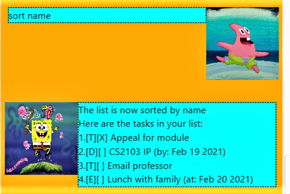
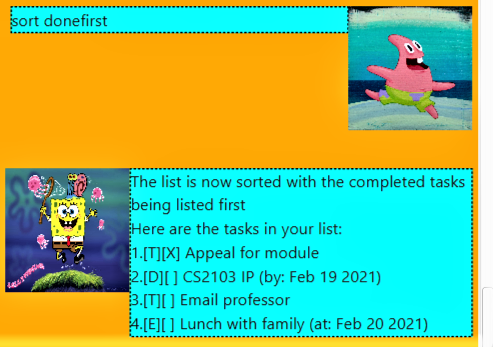
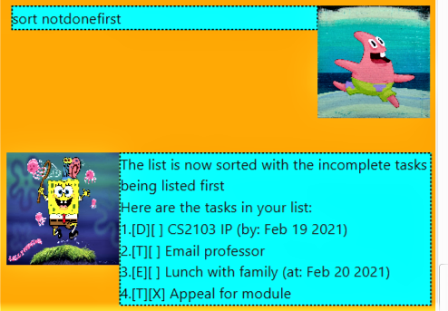

# Spongebob Duke User Guide

## Introduction

Spongebob duke is a personal assistant chatbot that can
also help you keep track of your tasks.

## Features 
The features offered by Spongebob duke are :

1. Add a task
2. List tasks
3. Mark a task as done
4. Delete a task 
5. Find a task
6. Sort tasks
7. Bye

### Add a task
Add a new task to the list. Spongebob duke supports 3 types of tasks :
1. ToDo, which are tasks that are not tied to a specific date.
2. Deadline, which are tasks that must be completed before a certain date.
3. Event, which are tasks that occur on a certain date.

The task list will also be automatically saved as a text file on the local hard disk. The
local text file will be automatically updated whenever there is a change in the task list.

### List tasks

Displays a list of all currently saved tasks.

### Mark a task as done

Mark the task at a particular index as completed.

### Delete a task

Remove the task at a particular index from the list.

### Find a task

Search for tasks containing a specific keyword.

### Sort tasks
Sort the tasks in the list according to one of the following criteria :
1. By name alphabetically.
2. By completed tasks first followed by incomplete tasks. 
3. By incomplete tasks first followed by completed tasks.

### Bye

Exits the program.

## Usage

### `todo` - Adds a todo task to the list

Format:

`todo [description]`

Example of usage:

`todo Email professor`

Expected outcome:

### `deadline` - Adds a deadline task to the list

The year of the date must be larger than 0.

Format:

`deadline [description] /by [YYYY-MM-DD]`

Example of usage:

`deadline CS2103 IP /by 2021-02-19`

Expected outcome:

### `event` - Adds an event task to the list

The year of the date must be larger than 0.

Format:

`event [description] /by [YYYY-MM-DD]`

Example of usage:

`event Midterm test /at 2021-02-18`

Expected outcome:

### `list` - Display all tasks in the list

Format:

`list`

Example of usage:

`list`

Expected outcome:

### `done` - Mark task as completed

Format:

`done [index]`

Example of usage:

`done 4`

Expected outcome:

### `delete` - Delete a task from the list

Format:

`delete [index]`

Example of usage:

`delete 3`

Expected outcome:

### `find` - Search for particular tasks in the list

Format:

`find [keyword]`

Example of usage:

`find CS`

Expected outcome:

### `sort name` - Sort by alphabetical order

Format:

`sort name`

Example of usage:

`sort name`

Expected outcome:

### `sort donefirst` - Sort by completed tasks first

Format:

`sort donefirst`

Example of usage:

`sort donefirst`

Expected outcome:

### `sort notdonefirst` - Sort by incomplete tasks first

Format:

`sort notdonefirst`

Example of usage:

`sort notdonefirst`

Expected outcome:

### `bye` - Exits the program

Format:

`bye`

Example of usage:

`bye`

